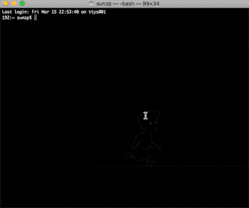

# 2048.node


> 🎮 Terminal version of the game "2048" written in Nodejs

<p align="center">
    </img>
</p>

# Install 

```
npm install -g 2048.node
```

# Start

```
2048node
```

# TODO

- [x] Play game
- [x] Number color
- [ ] Save score
- [ ] Game rank